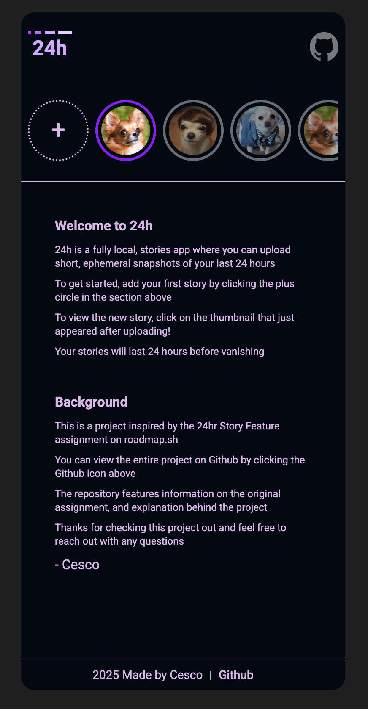
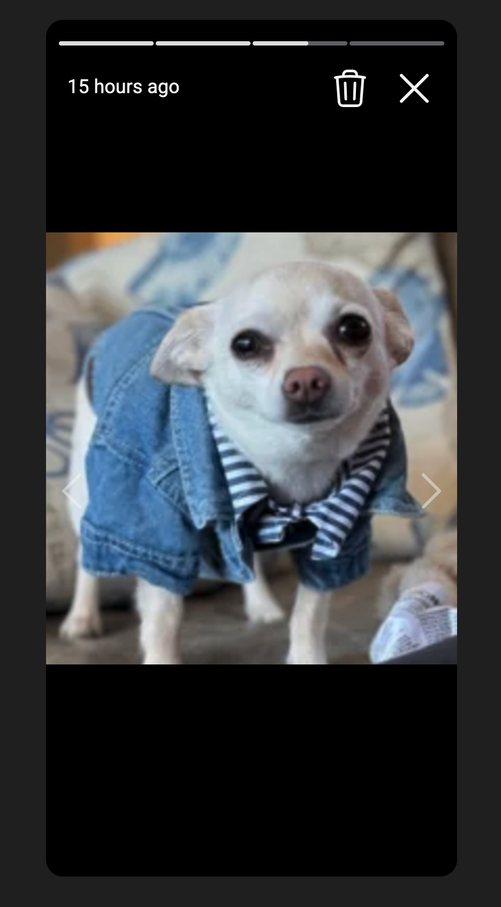
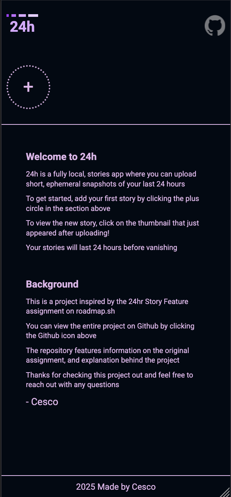
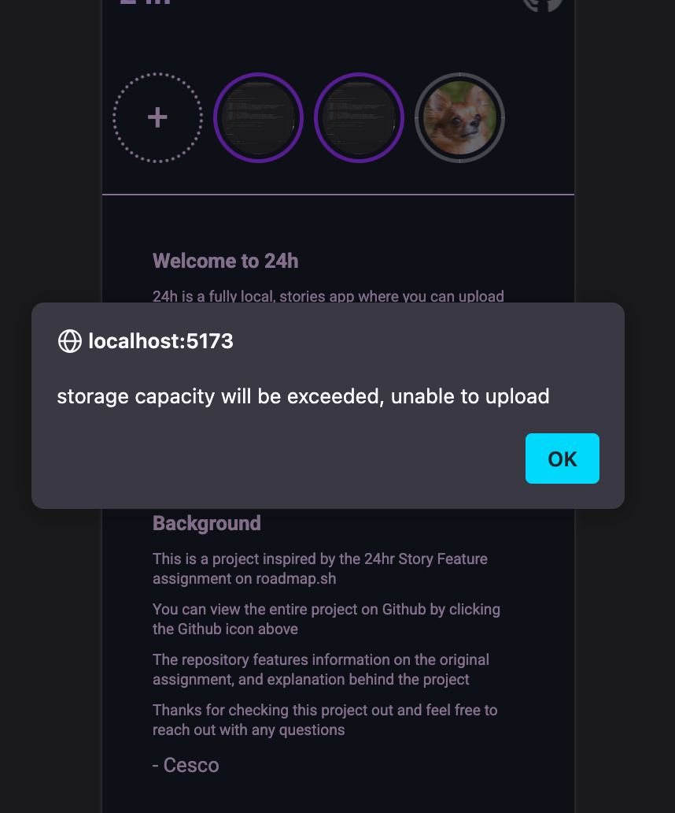

# 24h, a client side story clone 

24h is a client side story clone [project from roadmap.sh](https://roadmap.sh/projects/stories-feature). 24h allows users to upload an image as a 'story' which will
vanish after 24 hours. Stories will be ordered from most recent to oldest and seen to unseen. Note! This project is currently limited by the capacity of your browsers
local storage (~5mb), to test uploading lots of stories, use low resolution / low quality images.
<br>
<br>
Live Demo: [link](https://24h-story-clone.pages.dev/)

## How it was made:

**Tech used:** 
- Framework: React
- Build Tool: Vite
- Styling: TailwindCSS, CSS
- State Management: Jotai
- Other: 
  - Luxon for handling time
  - HeroIcons for trash, X, and left/right chevron icons
  - Google Fonts for Roboto font
  - Unsplash for demo pictures
  - Github Logo from Github

## Visual Examples
<br> Desktop Landing Page with uploaded stories <br>



<br> Viewing A Story Example <br>



<br> Mobile Landing Page with no stories <br>



<br> Error message when exceeding local storage <br>



## How To Run The Project

1. Download or clone the repo onto your local environment, and navigate into the folder
```
git clone https://github.com/cescosgames/story-clone
cd story-clone
```
2. Install dependencies
```
npm install
```
3. Run the dev server
```
npm run dev
```
4. Go to your selected local host in your browser (Vite default is 5173)

## Features:

Following the project guidelines, this project features...
1. Users can upload their own images
2. Images are stored locally in base64 
3. Image is displayed in a list of stories that will be removed after 24 hours
4. Each story has it's own individual progress bar taht lasts for 3 seconds before progressing
5. Client side only: everything is stored locally
6. Project is designed for mobile, but responsive on desktop
7. Images are constrained by size and displayed in full 

## Lessons Learned:

Definitely the most difficult project so far but overall a very good learning experience. While some aspects of this project were definitely out of my current knowledge, 
such as learning how to get the size of a base64 string and compare it to the amount of local storage available, researching how to solve these issues was a good challenge. 
Working with images as a whole was new territory for me and I still have a lot to learn but this was a great introduction to this area. 
<br><br>
On the topic of the 'get size of base64 string', since I fully lacked the knowledge on how to tackle a problem like that, I started with the solution, implemented it, and then 
tried to understand how it works. This isn't my favorite approach and this project pushed me into that territory which I haven't been in before with these projects. Knowing that
I took this approach, I'm certain that this project could be improved on with improved knowledge on local storage and image manipulation. 
<br><br>
Overall though, I really like how this project turned out. The main area where I would improve in the future given more time would be in storing images in a better fashion. The
local storage limit was a really big challenge throughout this project. I tried to outline my thought process throughout the code and outlined the main structure in the 'Phone'
component. Hopefully you can see the reasoning and explanations behind how everything was made. 
<br><br>
Thanks for checking this project out, and as always feel free to reach out for any questions / comments / concerns!